# VelvetBet, 2009
Online Betting Site, php/javascript/mysql

An online betting site from the old 2009 that is using one of the best AJAX User Interface Library (Yahoo's YUI) at the time. YUI is now discontinued and it is an open-source JavaScript library for building richly interactive web applications using techniques such as Ajax, DHTML, and DOM scripting.

You can read more at https://en.wikipedia.org/wiki/YUI_Library


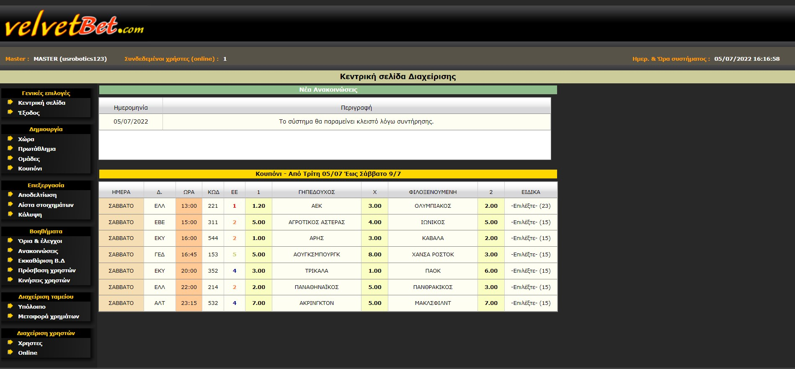
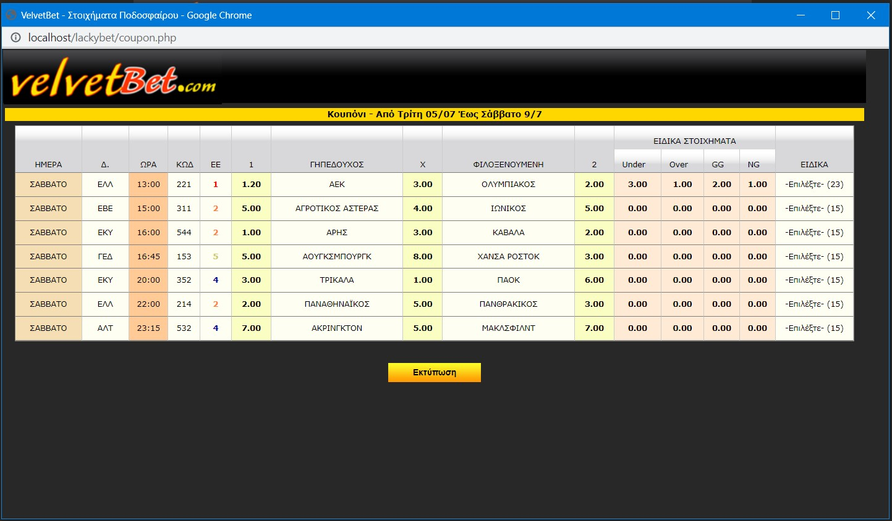
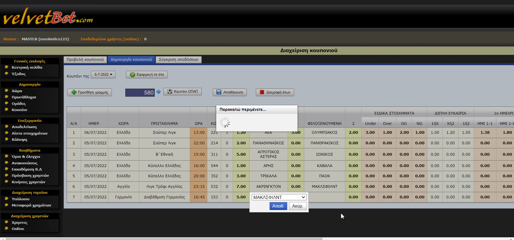
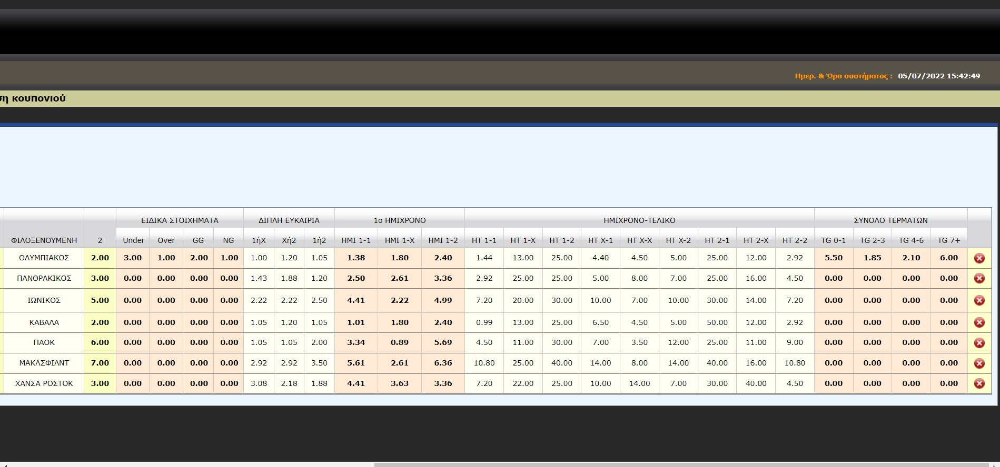
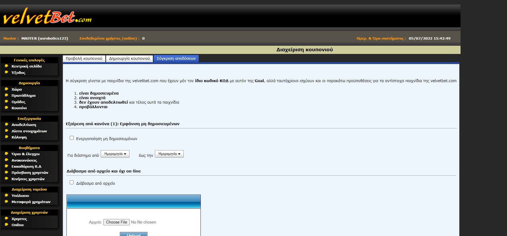
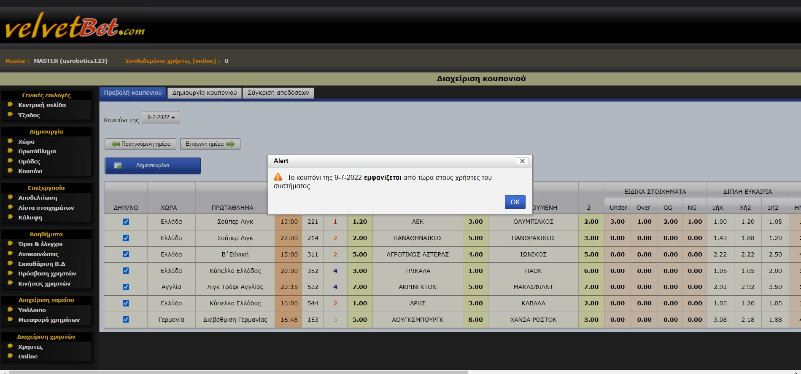
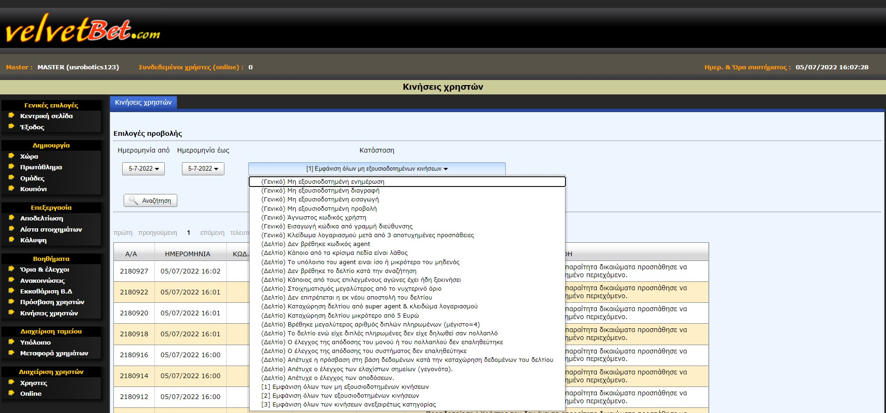
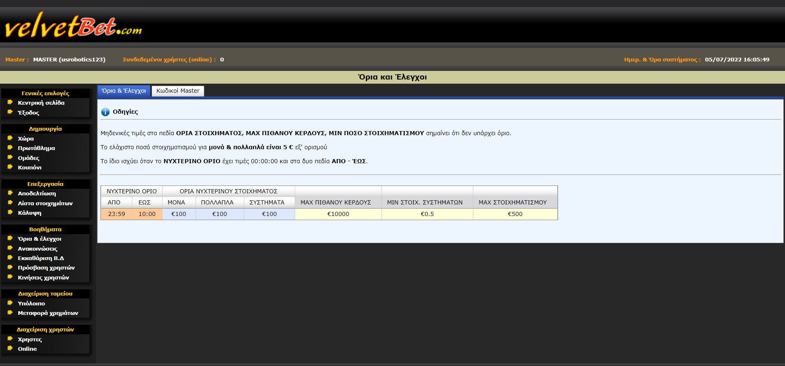
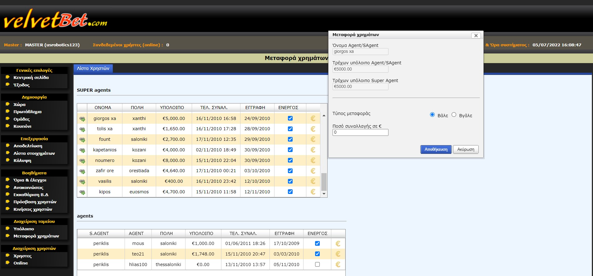
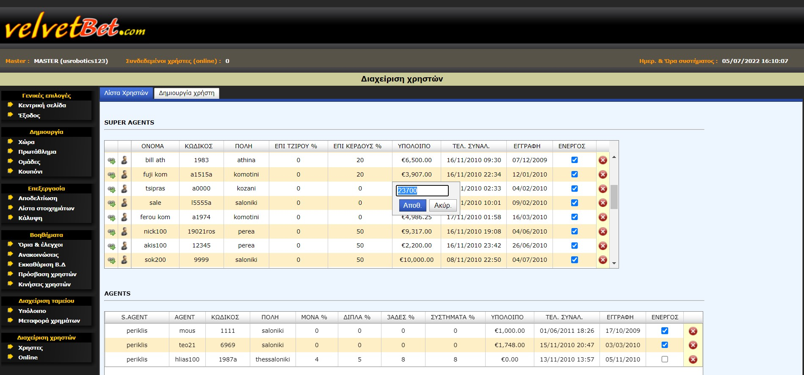
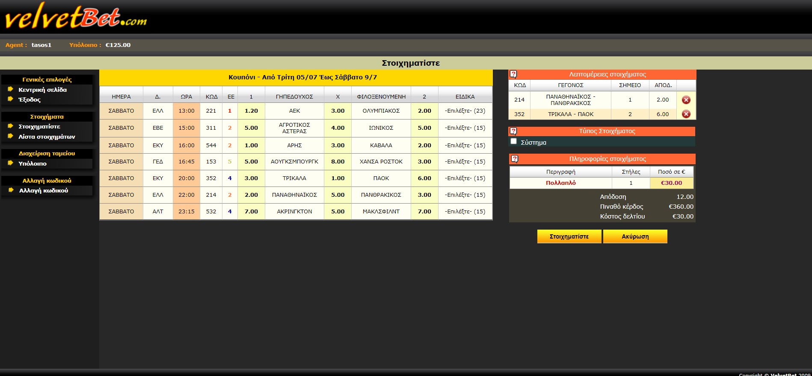
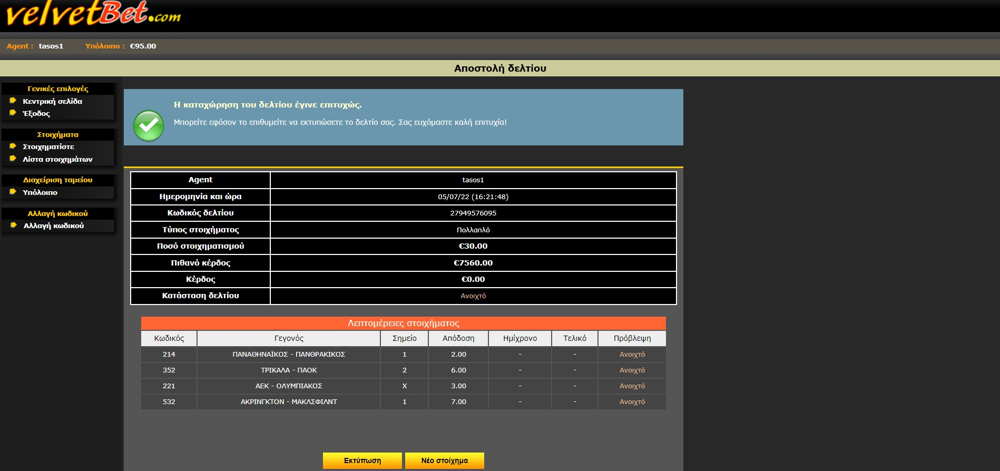


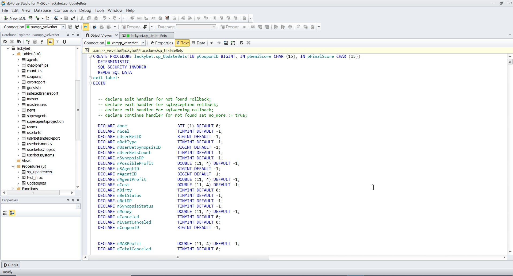


# Installation

1) Import the ```Install/mySQL_Tables_SampleData.sql``` using phpmyadmin or your preferred application
2) Import the Stored Procedure ```Install/sp_UpdateBets (Stored Procedure).sql``` using your preferred mysql application 
